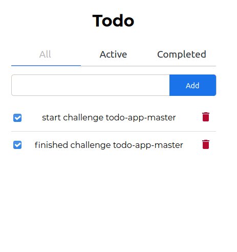

<h1 align="center">Todo app</h1>

   Solution for a challenge from  <a href="http://devchallenges.io" target="_blank">Devchallenges.io</a>

  <h3>
    <a href="https://todo-app-master.netlify.app/">
      Demo
    </a>
     | 
    <a href="https://devchallenges.io/solutions/UpRUtqfUW2lsrVxigmoE">
      Solution
    </a>
     | 
    <a href="https://devchallenges.io/challenges/hH6PbOHBdPm6otzw2De5">
      Challenge
    </a>
  </h3>

<!-- TABLE OF CONTENTS -->

## Table of Contents

- [Overview](#overview)
  - [Built With](#built-with)
- [Features](#features)
- [Contact](#contact)
- [Acknowledgements](#acknowledgements)

<!-- OVERVIEW -->

## Overview

I took up this challenge to pratical and learn redux.

### Built With

<!-- This section should list any major frameworks that you built your project using. Here are a few examples.-->

- [React](https://reactjs.org/)
- [Redux](https://redux.js.org/)
- [Netlify](https://app.netlify.com/)

## Features

<!-- List the features of your application or follow the template. Don't share the figma file here :) -->

This application/site was created as a submission to a [DevChallenges](https://devchallenges.io/challenges) challenge. The [challenge](https://devchallenges.io/challenges/Bu3G2irnaXmfwQ8sZkw8) was to build an application to complete the given user stories.

## Acknowledgements

<!-- This section should list any articles or add-ons/plugins that helps you to complete the project. This is optional but it will help you in the future. For example: -->

- [Redux](https://redux.js.org/)

## Contact

- GitHub [FlorianMilcendeau](https://github.com/FlorianMilcendeau)
- Twitter [Florian M](https://twitter.com/Florian14800066)
